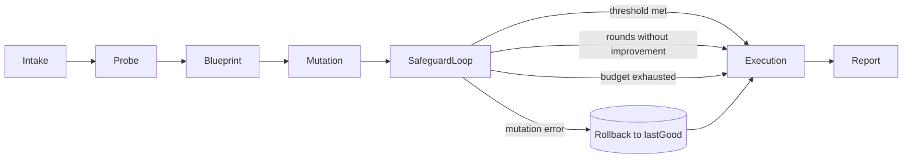

# ALMA — Adaptive Linguistic Metamorphosis Agent

## 1. What is ALMA?

ALMA is a "stem-cell" agent for linguistic transformation (EN, ES, PT) that lacks a fixed identity. Instead of rigid subclasses, the system analyzes the problem at runtime and specializes dynamically according to an injected Blueprint. It is a single agent that mutates to solve translation, transcreation, or style transfer depending on the context's needs.

Submitted as a JetBrains technical-test exercise.

---

## 2. Architecture: The 7 phases of the pipeline

The system operates sequentially, where each phase enriches a shared state object called `AgentContext`.

1. **`IntakePhase`** — Captures the user input and the problem class hint. It leaves the `userInput` and the `problemClassHint` in the `AgentContext`. *Example: The user sends a technical manual and the hint is "formal translation".*

2. **`ProbePhase`** — Exploratory call to the LLM that analyzes the problem without committing to a solution. It generates a `ProbeReport` that identifies which skills are needed and proposes synthetic tasks (fictional examples) to test itself later.

3. **`BlueprintPhase`** — Converts the `ProbeReport` into a strict `Blueprint` (Java record) deserialized from the JSON returned by the LLM. Fields: `title`, `systemPrompt`, `toolNames`, `criteria`, `modelName`, `scoreThreshold`, `maxRefinementRounds`. Defines the system prompt, the necessary tools, and the success thresholds.

4. **`MutationPhase`** — Instantiates a `SpecializedAgent` configured with the Blueprint and resolves the requested tools via `DefaultToolRegistry`. Leaves the `SpecializedAgent` ready in the context.

5. **`SafeguardLoopPhase`** — A refinement loop where the agent attempts to solve the synthetic tasks created in phase 2. If the agent achieves a better score than the previous one, an atomic promotion occurs (`AgentContext.promote()`); if it fails, the change is discarded (`rollback()`). Stops if it reaches the target score, exhausts the attempts, or if 2 rounds pass without improvement (`PATIENCE = 2`).

6. **`ExecutionPhase`** — The already validated, specialized, and "adult" agent is executed on the user's initial problem. Leaves the final result in the context.

7. **`ReportPhase`** — Delivers the final result and displays a detailed trace of how the agent evolved (attempted Blueprints, scores, promote/rollback decisions).



---

## 3. Key Components

**Core and State**
- **`SpecializedAgent`** — Single class whose identity is injected at runtime; materializes the "stem-cell" thesis.
- **`Blueprint`** — Immutable record that acts as the agent's DNA; built dynamically from JSON.
- **`AgentContext`** — Central memory of the process; manages state changes through atomic `promote()` and `rollback()`.
- **`StemCell`** — Orchestrator that executes the phases sequentially on the context.

**Intelligence and Tools**
- **`ProbeReport`** — Data structure with the initial analysis, suggested tools, and validation tasks.
- **`OpenAiClient`** — LangChain4j wrapper that alternates between cost-effective models (`chatProbe`) and production models (`chatExec`).
- **`DefaultToolRegistry`** — Eager registry of NLP tools (Detector, Tokenizer, Splitter, Normalizer, TermBase).

**Evaluation and CLI**
- **`CompositeScorer`** — Smart router; prioritizes mathematical metrics (`ChrfScorer`) if there is a reference, or `JudgeScorer` (AI) if there is not.
- **`JudgeScorer`** — AI evaluation that forces the generation of reasoning before issuing a score.
- **`EvalHarness`** — Automation of the 15-case benchmark using `./gradlew evaluate`.
- **`AlmaCommand`** — Command-line interface (picocli) with visual feedback via a 6-state ASCII mascot.

---

## 4. Architectural Decisions

The project's philosophy is to maintain simplicity with Java at all times over extreme efficiency.

**Blueprint — The Immutable DNA**
The LLM proposes how to solve the problem in a JSON, and Java converts it into an immutable record. Once the plan is "frozen" in Java, it is safe, predictable, and cannot change by mistake during execution.

**Quality and Control (Safeguards)**
- **Atomic Promotion (All-or-Nothing):** With `promote()` and `rollback()`, the system only accepts complete improvements. If an improvement attempt fails, the system instantly returns to the last stable version of the agent.
- **Separation of Powers (Generator vs. Evaluator):** The model that writes the response is not the one that grades it. This prevents the AI from "fooling itself" by approving its own mistakes.
- **Mandatory Reasoning:** The Judge must explain its motives in the `reasoning` field before giving a score. This forces it to "think" and detect flaws it would otherwise ignore.
- **Smart Stopping Rules:** Stops if it reaches the goal, exhausts its attempts, or stops improving after two rounds (`PATIENCE = 2`).

**Technical Efficiency and Performance**
- **Two-Model Strategy:** Uses a cost-effective model (`probeModel` → `gpt-4o-mini`) to plan and judge, and reserves the powerful model (`execModel` → `gpt-4o`) only for the final result. Lowers costs without eliminating quality.
- **Instantly Ready Tools:** `DefaultToolRegistry` loads all tools (dictionaries, detectors) at program startup. Loading times are shorter with the entire context ready from the first moment.
- **Hybrid Evaluation (`CompositeScorer`):** If there is a known "correct answer", it uses pure math (chrF). If the task is creative, it uses AI judgment.

---

## 5. Key Decisions

**The logo and appearance of ALMA**
ALMA in Spanish means soul/spirit, hence the mascot is a ghost. It seeks an interactive, simple interface with lots of feedback that works on any device.

**Selection of Java and Gradle with Kotlin DSL**
Java 21 was chosen for its symbolic value (first language) and as a differentiating factor against common Python/JS solutions. Gradle with Kotlin DSL ensures type safety, high performance, and total consistency with the JVM and IntelliJ ecosystem.

**Use of chrF and not BLEU**
chrF was selected due to the morphological complexity of Spanish and Portuguese. Unlike BLEU, which penalizes whole words, chrF evaluates character n-grams, allowing partial scores if the root is correct. This offers a more real and accurate correlation with human judgment for these languages.

**Use of generative AI in the development process**
The project was developed under the *Centaur Programming* philosophy (own philosophy explained in task 2), using Claude (Opus 4.7 and Sonnet 4.6). This AI-human collaboration allowed learning new technologies in record time and outlining the agent's architecture until reaching the desired level of specialization.

**Libraries used**
| Library | Purpose |
|---------|---------|
| **LangChain4j** | Main orchestrator; simplifies integration with OpenAI, tool use (`@Tool`), and dynamic system prompts |
| **Picocli** | CLI engine; captures arguments like `--lang` and renders aesthetic terminal output |
| **Apache OpenNLP** | Deterministic linguistic processing (tokenization, sentence splitting) for accurate chrF calculation |
| **Language Detector** | Automatically identifies input language to validate EN/ES/PT capability |
| **ICU4J** | Professional Unicode normalization; prevents invisible character differences from affecting transformation quality |
| **Jackson** | Transforms AI JSON responses into Java record objects with type safety |
| **SLF4J / Logback** | Log standardization to monitor mutation lifecycle and debug API calls |
| **JUnit 5 / AssertJ** | Testing infrastructure for promotion/rollback logic and evaluator correctness |

---

## 6. Results and Benchmark

A 15-input benchmark was performed comparing a `BaselineAgent` against ALMA:

| Sub-Type | Baseline | ALMA | Δ |
|----------|----------|------|---|
| Translation (10) | 0.876 | 0.854 | -0.023 |
| Transcreation (4) | 0.919 | 1.000 | +0.081 |
| Style (1) | 1.000 | 0.900 | -0.100 |
| **TOTAL (15)** | **0.896** | **0.896** | **0.000** |

---

## 7. Retrospective: Failures and Learnings

- **Verbosity penalizes chrF:** In single-term tasks (e.g., `wd-en-es-1`), ALMA tends to be explanatory. By adding more characters than the exact reference, the chrF metric drops drastically (-0.391) even if the answer is correct.
- **Non-determinism of the Judge:** Variations of up to 0.1 in the score were detected for the exact same string. This confirms the need to force prior reasoning to stabilize the criteria.
- **Fragile References:** In literal translation, ALMA proposed valid grammatical variants that, by not matching the reference letter by letter, were mathematically penalized.
- **Ceiling Effect:** In 60% of the benchmark (9/15), the system reaches a plateau of 1.000, suggesting that linguistic challenges of greater complexity are required for future tests.

---

## 8. Test Case: Andalusian Dialect

To test the "Stem-Cell" capability, the agent was subjected to a normalization and translation challenge of a dialect with a high phonetic and cultural load; the result was extremely positive.

```bash
./gradlew run --args='run "Translate to English (colloquial/rural tone): Nene Manue\', ¿como le va a tu hijo en la aceituna? que me enterao'\'' que con la lluvia eta'\'' la cosa va pa'\'' tra'\''."'
```

Challenges: vocative ("Nene Manue"), metonymy ("aceituna"), phonetics ("me enterao"), and idiom ("va pa tra'").

---

## 9. Installation and Deployment

**Prerequisites:** JDK 21 or higher, `OPENAI_API_KEY` with access to `gpt-4o` and `gpt-4o-mini`.

**Setup:**
```bash
# Clone and enter the project
git clone <repo-url> && cd ALMA

# Create your .env from the example
cp .env_EXAMPLE .env
# Edit .env and add your API key: OPENAI_API_KEY=sk-...

# Load variables so the JVM can read them
set -a && source .env && set +a
```

**Technical validation (no API tokens consumed):**
```bash
./gradlew test
# Expected: 41 green tests — mutation logic, chrF calculation, atomic rollback
```

**Run a single task:**
```bash
./gradlew run --args='run "Translate to PT: Hello world"'
# Optional flags: --lang pt  |  --no-color
```

**Full benchmark:**
```bash
./gradlew evaluate
# Report → build/reports/eval-<timestamp>.md
# Token usage → build/reports/token-usage.csv  (projected cost: $0.07–$0.15 per full run)
```

**Report persistence:**
Archive reports before `./gradlew clean` — the clean task deletes everything under `build/`:
```bash
cp build/reports/eval-*.md docs/reports/
```

---

## Project Layout

```
src/main/java/alma/
├── Main.java                       fail-fast on missing key, then picocli
├── cli/                            picocli root, ANSI palette, ghost mascot
├── core/                           Phase, AgentContext, StemCell, MutationException
│   └── pipeline/                   IntakePhase → ProbePhase → BlueprintPhase →
│                                   MutationPhase → SafeguardLoopPhase → ExecutionPhase → ReportPhase
├── agents/                         Blueprint, SpecializedAgent, ProbeReport, EvalTask, EvalReport
├── llm/                            OpenAiClient, PromptTemplates, JsonExtractor, ToolRegistry
├── nlp/                            LanguageDetector, Tokenizer, SentenceSplitter, IcuNormalizer, TermBaseLookup
├── eval/                           BaselineAgent, EvalHarness, ChrfScorer, JudgeScorer, CompositeScorer
└── config/                         AlmaConfig, EnvLoader

src/main/resources/
├── prompts/                        probe.txt, blueprint.txt, refine.txt, judge.txt
├── banners/                        alma-{base,thinking,probing,mutating,speaking,error}.txt
├── nlp/                            en-sent.bin, es-sent.bin, pt-sent.bin
├── termbase.json                   EN/ES/PT terminology base
└── benchmarks/linguistic.json      15-entry eval set
```
# ALMA-for-JetBrains
